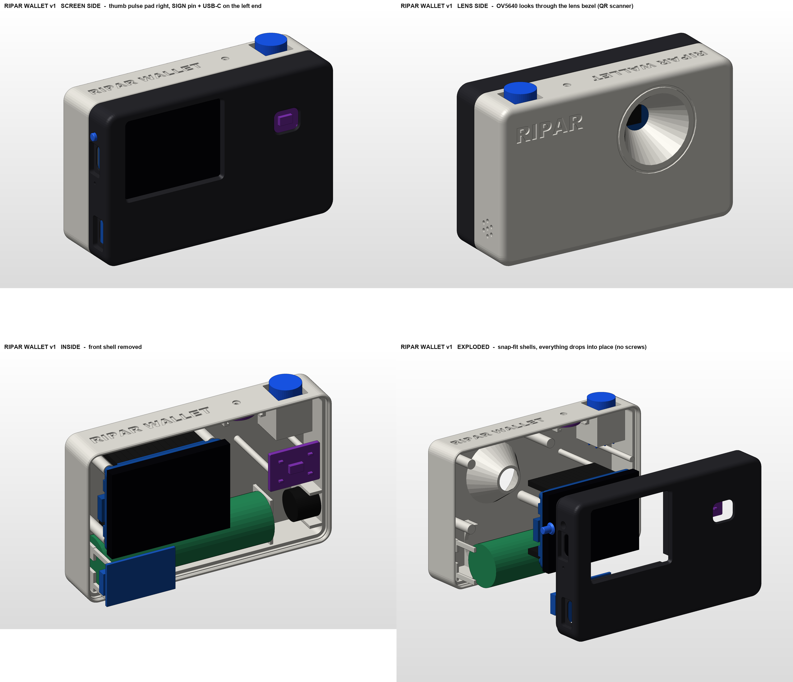

# Ripar Wallet v1: air-gapped, pulse-verified hardware signer

A camera-shaped, air-gapped signer for the **Monad Metropolis** hackathon. The same shell later becomes a digital camera.

- The **camera** reads a transaction QR.
- The **screen** shows what you're about to sign.
- Your **thumb** rests on a **MAX30102 pulse sensor**. The device signs only while a real heartbeat is present *and* you press **SIGN**. It then shows the signature as a QR.



## What's here

| Path | What |
|---|---|
| `print/bambu/` | **Sliced, ready-to-print P1S file**: `RiparWallet_ALL_P1S.gcode.3mf`, with every part on one plate (about 2 h 23 min, 69.5 g PLA) |
| `print/stl/` | STLs for the Bambu P1S, pre-oriented: Front_Shell, Back_Shell, Sign_Pin, and 2 fit-test coupons |
| `print/step/` | STEP files of every printable part plus the full assembly (for Fusion, FreeCAD or sharing) |
| `print/PRINTING.md` | Slicer settings, what to measure first, assembly order, fixes |
| `docs/WIRING.md` | Header pinout from the Waveshare schematic, free GPIOs, and every connection |
| `docs/RiparWallet_Build_Guide.pdf` | The whole build in one PDF: print, wire, assemble, test, flash |
| `firmware/` | ESP32-S3 firmware (PlatformIO, Arduino-ESP32): source, host tests, companion tools |
| `docs/FIRMWARE.md` | Firmware build, flashing, screens and keys, walkthrough, security model |
| `docs/PROTOCOL.md` | Byte-level device ↔ companion ↔ contract protocol (BC-UR, CBOR, EIP-712) |
| `firmware/emu/` | The device **emulator**: the firmware's own C++ compiled to WebAssembly (runs in the browser) |
| `contracts/` | Solidity (Foundry): PulseCosignEnforcer, device registry, sentinel, reputation relay, MockUSD; `SPEC.md` |
| `docs/DEPLOY.md` | Deploying the contracts to Monad testnet (you run it with your own key) |
| `packages/protocol/` | `@ripar/protocol`: TypeScript protocol library, byte-exact with the firmware |
| `agent/` | The untrusted AI treasury agent (Qwen tool loop, AUTO payments, escalation to the device) |
| `companion/` | The companion web app (camera QR or the in-page EMULATOR) |
| `companion-mobile/` | The **Android app** (Expo): Polaris-style wallet UI, QR link (default) + Bluetooth fallback + emulator |
| `docs/BLE_LINK.md` | The optional Bluetooth LE fallback link: protocol and security model |
| `scripts/dev-stack.sh` | One command: local fork of Monad testnet + contracts + agent + companion |
| `model/RiparWallet.SLDASM` | SolidWorks 2026 assembly: native parts plus component stand-ins |
| `model/parts/*.SLDPRT` | Native SolidWorks parts (feature trees built by script) |
| `model/renders/` | Renders; `sheet.png` is the overview |
| `model/interference_report.json` | SolidWorks interference detection result |
| `cad/` | The parametric CAD pipeline (Python → SolidWorks COM) |
| `research/` | CAD design reviews (fit, printability, assembly) and researched part dimensions |

## Try it without hardware (about 5 minutes, nothing touches a public chain)

Needs Node 22, Foundry and Git Bash (Windows) or any POSIX shell.

```bash
git clone --recursive https://github.com/nickthelegend/ripar-wallet && cd ripar-wallet
npm install
bash scripts/dev-stack.sh          # anvil fork of Monad testnet, contracts, agent, companion
```

Open the printed `http://127.0.0.1:5173/?devstack`, choose **Device: EMULATOR**, then follow the app:
pair, deploy and fund the vault, sign a mandate, "Ask the agent to run now", and answer its escalations on the
emulated device (thumb on, SIGN). `bash scripts/dev-stack.sh e2e` runs the whole 25-step story headlessly.

## The Android app (`companion-mobile/`)

A phone wallet for your Ripar, in signal orange on graphite.

- **Onboarding:** leads with the air gap ("Keys that never touch the internet", "It signs only what it shows", "A real heartbeat, then SIGN"), then *Pair your Ripar*.
- **Tabs:**
  - **Home:** vault balance card with Send / Receive / Scan / Device, spending insights and recent activity.
  - **Activity.**
  - **Device:** link choice, pairing, kill switch and the SIGN-key table.
  - **Agents:** optional; AI mandates and the co-sign inbox.
  - **Settings.**
- **Send:** a Polaris-style keypad sheet, then confirm, then the device (review, thumb, SIGN), then *Done.* Every payment from the vault needs the device. The phone's key only submits what the device co-signed: a "personal mandate" with AUTO caps 0.
- **Device link helpers** (`src/device/link.ts`): `sendToDevice()`, `awaitDeviceResponse()` and `requestAndVerify()` work the same over three links:
  - **QR** (default, air-gapped): animated QR on the phone, camera reads the device's answer.
  - **Wi-Fi test link** (`docs/WIFI_LINK.md`, temporary): the phone gives the device your Wi-Fi network over Bluetooth, and you confirm on the device. The app then talks to it over the local network, using an 8-digit code shown on its screen. It is a testing aid only: it is not air-gapped and will be removed for the pitch build.
  - **Bluetooth fallback** (`docs/BLE_LINK.md`): for when the device camera cannot read. The device's radio stays **off** until you wake it on the device (menu → BLE LINK → pulse + SIGN). A **RADIO ON** badge shows while it is on, and it turns off after 5 min idle, on PANIC and at power-off. Pairing uses a 6-digit code confirmed with SIGN.
  - **Emulator:** the real firmware in a WebView, demo keys only.

```bash
cd companion-mobile && npm install
npx expo start --web                                   # preview the screens in a browser
npx expo prebuild --platform android && (cd android && ./gradlew assembleDebug)   # debug APK
adb install -r android/app/build/outputs/apk/debug/app-debug.apk
```

## Flashing and testing the hardware

| Build (`firmware/`) | What it is |
|---|---|
| `pio run -e chk_device -t upload` | **Hardware check first:** display, SIGN key, buzzer, pulse sensor, camera and key self-test, radio-free. Serial log at 115200. SIGN press = next screen (home, scan, pulse, QR, review, message); hold 2 s = action (scan: restart camera; pulse: LED challenge); hold 5 s = error buzz. |
| `pio run -e ripar -t upload` | **Testing build:** the wallet with QR, plus a Bluetooth fallback and a **temporary Wi-Fi test link** (`docs/WIFI_LINK.md`). Both radios stay off until you enable them on the device, and the screen shows the badge while one is on. |
| `pio run -e ripar-ble -t upload` | The wallet with QR and the Bluetooth fallback only. |
| `pio run -e ripar-airgap -t upload` | The wallet with no radio code at all: the build that proves the air-gapped claim. **Use it for the pitch and the demo video.** |

**Pulse sensor:** the MAX30102's SDA goes to **GPIO48** and SCL to **GPIO47** (the VIN/SDA/SCL/GND row of the sensor, not GND/RD/IRD/INT). For a pulse-only bench test, flash `PLATFORMIO_BUILD_FLAGS="-DRIPAR_CHECK_START_PULSE=1" pio run -e chk_device -t upload`: it starts on the pulse screen and logs bpm, beats and pass status to serial. The device uses the *standard* pulse gate; see `docs/FIRMWARE.md`, "Pulse gate: standard and strict".

Plug in the **board's own USB-C** with a **data** cable, never the TP4056's port and never both. If Windows shows *Unknown USB device* or no COM port appears, enter download mode: hold **BOOT**, tap **RST**, release BOOT, then upload again and tap RST to start. `pio device monitor -b 115200` shows the log.

## The enclosure

- **Size:** 100 × 62 × 32 mm, landscape, camera-shaped.
- **Two shells, no screws.** They meet at a parting line 13 mm behind the screen.
  - A 1.26 mm lip on the front shell slides into a rebate in the back shell.
  - A 0.25 mm ramped **snap bead** clicks into a groove.
  - To open, put a fingernail in the notch on the bottom seam.
- **The board stays put with no fasteners.** The Waveshare ESP32-S3-LCD-2 sits glass-first against the screen window, located by the top and left walls plus two printed fences. Four flat pegs in the back shell press on its M2 SMT nuts when you close it.
- **Every other part drops into a printed cradle:**
  - 18650 cell: saddles plus hold-down ribs;
  - TP4056 USB-C: cradle;
  - 12 mm latching power switch: square cradle with a floor stop;
  - MAX30102: pocket with a 0.7 mm skin and a 10 × 8 mm chamfered thumb window, backed by two posts;
  - INMP441: slide-in rails under the top wall with a Ø1.5 port;
  - buzzer: U-cradle behind a 7-hole grille.
- **The camera looks out through a 33° lens hood.** The OV5640 sits on the back of the board, and the hood is sized so even the 68° diagonal field of view isn't clipped. It doubles as the QR scanner.
- **Lettering:** "RIPAR WALLET" is debossed on the top and bottom faces, and "RIPAR" on the lens face.
- **Checked in SolidWorks:** interference detection found **0 unexpected collisions**. The only hits are header pins inside their jumper plugs, which is correct, plus sub-0.03 mm³ contact slivers at the TP4056 port. All STLs are watertight.

**Change a dimension:** edit `cad/design.py`, then run:

```bash
python cad/make_all.py
```

That rebuilds the parts, the assembly, the interference check, the STL/STEP exports, the sliced P1S files and the renders, in about 15–20 min.

- **Requirements:**
  - Windows with **SolidWorks 2026** at its default install path;
  - **Bambu Studio** at `D:\Program Files\Bambu Studio` (edit `BS` in `cad/slice_bambu.py` if yours is elsewhere);
  - Python 3 with `pywin32`, `numpy`, `trimesh`, `Pillow`.
- It uses its own SolidWorks session; run only one SolidWorks at a time.

## The firmware

- **Keys, generated on the device.** K1 (secp256k1, BIP-32 `m/44'/60'/0'/0/0`) owns the vault and signs only MetaMask delegation mandates. P1 (P-256, SLIP-10 `m/7951'/0'`) signs co-signatures, deny, PANIC, revoke, reopen and Privy requests. Both use RFC 6979 with low-s.
- **Air-gapped.** Wi-Fi and Bluetooth are never initialised, and the linked binary contains no radio symbols. Requests and replies move only as (animated) BC-UR QR codes, scanned by the OV5640 with quirc.
- **Signs only what it shows.** Every EIP-712 digest is rebuilt from the decoded fields on screen. SIGN arms only after the last review row has been shown and while the pulse still counts as live (at least 5 beats in 8 s, 40–180 bpm).
- **Refuses unsafe requests**, showing the exact reason. For example, it refuses:
  - a mandate without the pulse co-sign caveat;
  - a chain or contract that wasn't pinned at pairing;
  - unknown calldata or caveats;
  - a token it can't show;
  - any Privy change outside the allowlist.
- **One key.** SIGN (BOOT) supports press, hold 2 s and hold 5 s. A press or hold only works on the screen where it started. On Home, holding 5 s triggers PANIC.

```bash
cd firmware
pio run -e ripar -t upload                  # build + flash over the board's USB-C
python test/host/run_host_tests.py          # 10 host suites vs. an independent Python reference
python tools/make_request.py selftest       # companion tool: build -> simulate -> verify
```

- **Firmware v1.2:** the device derives its vault from its own key (MetaMask SimpleFactory CREATE2) and has the Ripar contract addresses compiled in, so a malicious companion cannot substitute a vault or contract. PANIC FIRST guard before re-pairing; pulse gate hardened against synthetic spoofs.
- **Verified on the PC:** host tests 10/10, device build RAM 12.1 % / flash 11.3 %, no radio symbols; the emulator runs the same code (570 checks).
- **Not yet run on a real board.** The pulse thresholds were tuned on synthetic signals only. See [docs/FIRMWARE.md](docs/FIRMWARE.md) for the known limitations (seed not encrypted yet, crypto not constant-time).

## The contracts

- **PulseCosignEnforcer**: a MetaMask delegation caveat. The agent's AUTO path spends inside per-tx and per-period caps, only to payees a human approved under this mandate, while the sentinel lane is open. Everything else needs the device's P-256 co-signature, checked by Monad's precompile at `0x0100`. Device-signed revoke and PANIC.
- **RiparDeviceRegistry**, **RiparSentinel** (Chainlink CRE can only close the AUTO lane; only the device reopens it), **RiparReputationRelay** (ERC-8004 feedback), **MockUSD** (testnet).
- Hardened by an adversarial review (5 reviewers, 25 findings, 12 confirmed and fixed, the rest documented in `contracts/SPEC.md`). 715 Foundry tests, including the firmware's own vectors and full redemptions through the real MetaMask DelegationManager.
- Deterministic CREATE2 addresses (compiled into the firmware):

| Contract | Address |
|---|---|
| PulseCosignEnforcer | `0x64d61fe5438981DC803ED61250FEf024617ae7eE` (10143 and 143) |
| RiparDeviceRegistry | `0xA08a47c9d645926615CF04D69b7a048133F68c9f` (10143 and 143) |
| RiparReputationRelay | `0xE433dCA75CA6cd730b1006F51A26208B000eA9E2` (10143) |
| MockUSD | `0xB5b7eaffbF9bf68cbcC1Ce8B5850b2ea9d6f9a2a` (10143) |
| RiparSentinel | depends on your CRE workflow owner (see `docs/DEPLOY.md`) |

## Monad Metropolis

- **Track:** 04, Trust, Identity & AI Infrastructure.
- **Pitch:** a camera-shaped, air-gapped signer that puts a live human thumb between AI agents and your money.
  - An AI agent holds a scoped MetaMask delegation on Monad and spends inside its mandate by itself.
  - Anything bigger, to a new payee, or after the risk sentinel trips, needs a P-256 co-signature from Ripar. Monad's precompile at `0x0100` checks it (about 6,900 gas).
  - Ripar produces that signature only after it has decoded the request itself and felt a live pulse.
- **Sponsor integrations we plan:**

| Bounty | What we build |
|---|---|
| Qwen 3.8 Max | the treasury agent itself |
| Privy | server wallet whose owner quorum is the device's P-256 key, plus gas sponsorship |
| Nansen | payee risk classes that force a second pulse |
| Mera | PRF-encrypted agent memory |
| Chainlink CRE | sentinel that can only *close* the autonomous lane |
| Envio | HyperIndex trust dashboard |
| Alchemy | RPC plus webhooks |

**Fallback if camera QR scanning is unreliable:** the companion's built-in, clearly labelled EMULATOR runs the device's own code.
